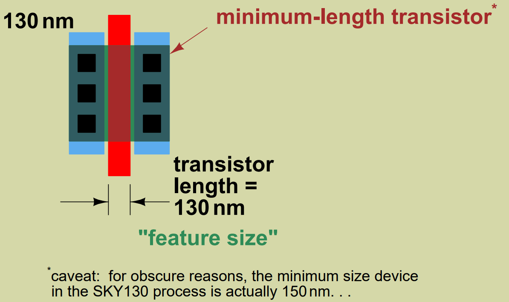
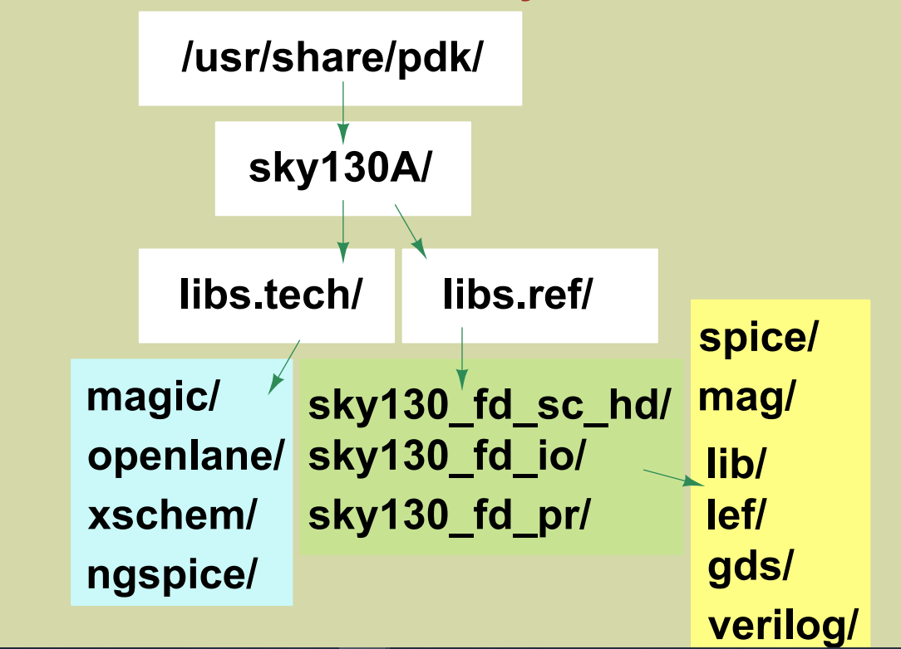
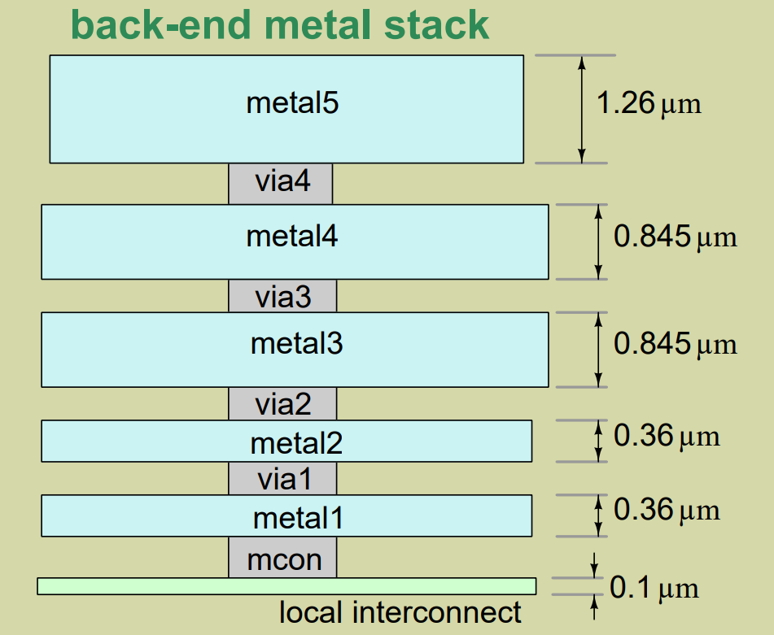
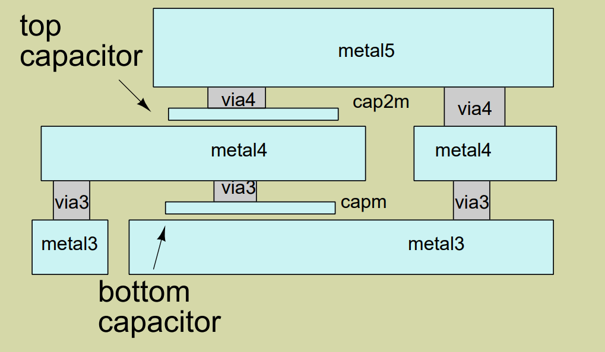
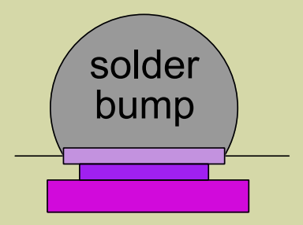
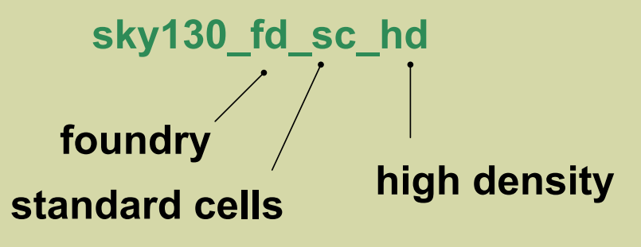
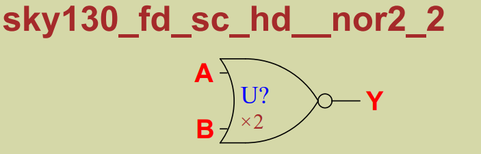

<h1> Day 1 - Introduction to Skywater Sky130 PDK.</h1>
<h2> SkyWater Open PDK </h2>

<p>A process design kit (PDK) is a set of files used within the semiconductor industry to model a fabrication process for the design tools used to design an integrated circuit. The PDK is created by the foundry defining a certain technology variation for their processes. </p>

<br/>

<br/> <br/>

<h2> Steps to install SKY130 PDK </h2>

```
git clone https://github.com/RTimothyEdwards/open_pdks
cd open_pdks
configure --enable-sky130-pdk
make
sudo make install
```

<br/>

<h2> Open source tool supporting open PDK </h2>
<br/>

**Magic** -  Used to draw custom layout for schematic.
<br/>

**KLayout** - Layout editor and viewer and can do DRC as well.
<br/>

**OPENLANE** - Synthesis and place and route tool
<br/>

**Xschem** - Schematic editing tool.
<br/>

**Netgen** - LVS tools working with netlist.
<br/>

**Ngspice** - Analog simulation tool and it used openPDK models.
<br/>

<h2> Standard Cells </h2>

<UL>
<LI> Digital Standard cells - sky130_fd_sc (1.8V)  (only sky130_fd_sc_hdl - 3.3V).</LI>
<LI>Analog - sky130_fd_pr</LI>
<LI>I/O Cells - sky130_fd_io (pads)</LI>
<LI>3rd-party libraries</LI>
</UL>

<br/>

<h2>Sky130 File structure </h2>

<br/>



<h2> Layers </h2>
 There are 5 layers of Aluminium metal. There is also a titanium Nitride(TiN) layers for local interconnect. It shouldn't be used for routing but it can be used for power and ground. These are backend layers and everything below this are frontend layers.

 <br/>
 
 <br/>

 The frontend layers are diffusion and ion implantation layers. The diff layers heavily doped region used for source and train and tap for oppositely doped regions for well and contact.

 The deep nwell which is buried very deeply nwell. The HVI layers is high voltage implant. The MiM cap layers are capacitors (Metal insulator metal). It forms a capacitor by adding metal plates between metal routers.

 

 The Redistribution layer (Copper) are used for packing. The die itself can be used as package by adding solder bumps on top of this layer. So no wire bonding is needed.

 

 <h2> Libraries </h2>

 

<br/>


Lower numbers at last have weaker drive output and stronger numbers have stronger drive output.

<h2> Open Source flows </h2>

Taking an example of basic analog circuit flow

<OL>
<LI> Schematic - Draw the schematic using xschem and test it using ngspice (analog simulator) and gaw (for waveform viewing) using the netlist. </LI>
<LI>Layout - Draw the layout using magic.</LI>
<LI> DRC and LVS. The LVS tool compares the netlist from synthesis and netlist from DRC passed layout.</LI>
</OL>

<h1> Lab work </h1>

