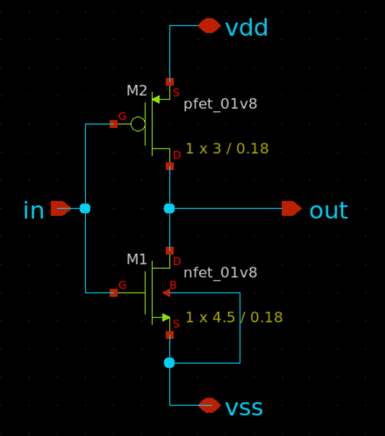
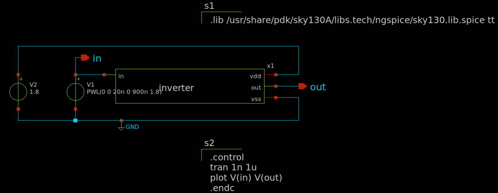
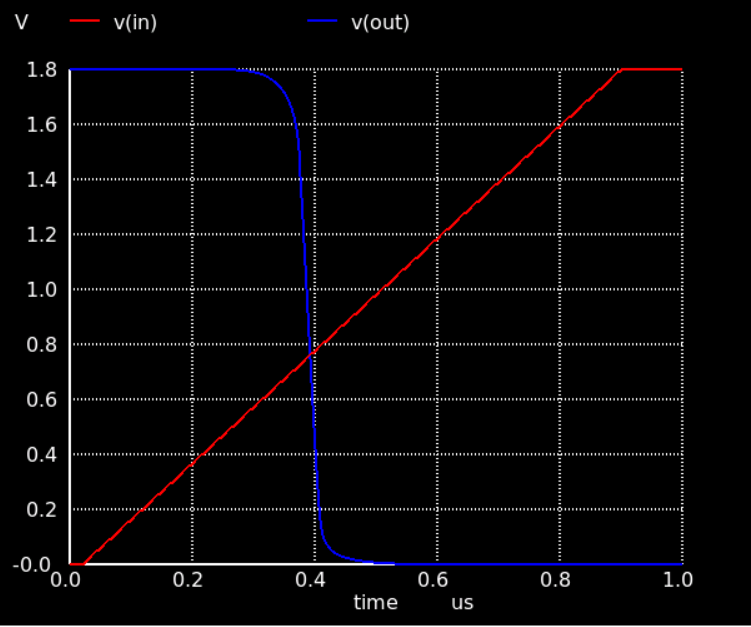

<h1> Day 1 - Introduction to Skywater Sky130 PDK.</h1>
<h2> SkyWater Open PDK </h2>

<p>A process design kit (PDK) is a set of files used within the semiconductor industry to model a fabrication process for the design tools used to design an integrated circuit. The PDK is created by the foundry defining a certain technology variation for their processes. </p>

<br/>

<br/> <br/>

<h2> Steps to install SKY130 PDK </h2>

```
git clone https://github.com/RTimothyEdwards/open_pdks
cd open_pdks
configure --enable-sky130-pdk
make
sudo make install
```

<br/>

<h2> Open source tool supporting open PDK </h2>
<br/>

**Magic** -  Used to draw custom layout for schematic.
<br/>

**KLayout** - Layout editor and viewer and can do DRC as well.
<br/>

**OPENLANE** - Synthesis and place and route tool
<br/>

**Xschem** - Schematic editing tool.
<br/>

**Netgen** - LVS tools working with netlist.
<br/>

**Ngspice** - Analog simulation tool and it used openPDK models.
<br/>

<h2> Standard Cells </h2>

<UL>
<LI> Digital Standard cells - sky130_fd_sc (1.8V)  (only sky130_fd_sc_hdl - 3.3V).</LI>
<LI>Analog - sky130_fd_pr</LI>
<LI>I/O Cells - sky130_fd_io (pads)</LI>
<LI>3rd-party libraries</LI>
</UL>

<br/>

<h2>Sky130 File structure </h2>

<br/>


<h2> Layers </h2>
 There are 5 layers of Aluminium metal. There is also a titanium Nitride(TiN) layers for local interconnect. It shouldn't be used for routing but it can be used for power and ground. These are backend layers and everything below this are frontend layers.

 <br/>
 
 <br/>

 The frontend layers are diffusion and ion implantation layers. The diff layers heavily doped region used for source and train and tap for oppositely doped regions for well and contact.

 The deep nwell which is buried very deeply nwell. The HVI layers is high voltage implant. The MiM cap layers are capacitors (Metal insulator metal). It forms a capacitor by adding metal plates between metal routers.

 

 The Redistribution layer (Copper) are used for packing. The die itself can be used as package by adding solder bumps on top of this layer. So no wire bonding is needed.

 

 <h2> Libraries </h2>

 

<br/>


Lower numbers at last have weaker drive output and stronger numbers have stronger drive output.

<h2> Open Source flows </h2>

Taking an example of basic analog circuit flow

<OL>
<LI> Schematic - Draw the schematic using xschem and test it using ngspice (analog simulator) and gaw (for waveform viewing) using the netlist. </LI>
<LI>Layout - Draw the layout using magic.</LI>
<LI> DRC and LVS. The LVS tool compares the netlist from synthesis and netlist from DRC passed layout.</LI>
</OL>

<h1> Lab work </h1>

<h2> Project directory structure </h2>

```
mkdir inverter
cd inverter
mkdir xschem
mkdir mag
mkdir netgen

//For xschem
cd xschem
//Now link schemrc and ngspice
ln -s /usr/share/pdk/sky130A/libs.tech/xschem/xschemrc
ln -s /usr/share/pdk/sky130A/libs.tech/ngspice/spinit .spiceinit

//For Magic
cd mag
ln -s /usr/share/pdk/sky130A/libs.tech/ngspice/spinit .spiceinit

//For netgen
ln -s /usr/share/pdk/sky130A/libs.tech/magic/sky130A.magicrc .magicrc

//Running (Go to correpsonding folder)
xschem
magic or magic -d XR (better rendering) or magic -d OGL (openGL)

```
Magic shortcuts: <br/>
Shift + Z - Zoom out <br/>
E - Erase <br/>
V - ft view <br/>
Ctrl + P - open device properties <br/>
: - start a command <br/>

Xschem shortcuts:
F - resize <br/>
Insert key - insert symbol <br/>
M - Move
C - Copy
W - Wire
Q - Parameter window

<h3> Creating the schematic </h3>

<br/>



<br/>

<h3> Creating the Testbench </h3>

<br/>



<p> Use code_shown.sym for adding the testing code. Click Netlist button and then Simulate button</p>

<br/>

<h3> Simulation results </h3>

<br/>



<p> Also edit the inveter circuit and check "LVS netlist; Top level is a .subckt".
Click netlist button again.
</br>

<h3>Layout</h3>

Goto the magic folder and start magic. Now File -> import spice and import inverter.spice

Magic shortcuts:

I -> Select instance. <br/>
M -> Move.<br/>
S -> Select Pins.<br/>

```
In Pfet and Nfet
Set Top guard ring via coverage : 100
Source via coverage : 40
Drain via coverage : -40
```
Drawing a box for painting -> S -> Select and then use right clicks to adjust the size of box by clicking on the edges. Now hover it on VSS block and click on middle mouse to paint with the same layer as VSS.

To extend a rectangular shape horizontally, create a box using the above method, use space to drag and then press middle mouse to paint the layer.

File -> Save -> Autowrite (To Save)

```
extract do local
extract all
ext2spice lvs
ext2spice
```

<h3> LVS </h3>

```
Go to netgen folder
netgen -batch lvs "../mag/inverter.spice" "../xschem/inverter.spice" 
```

<h3> Capacitance Extraction </h3>

```
Go to magic directory
extract do local
extract all
ext2spice lvs
ext2spice cthresh 0
ext2spice

```