<h1> Day 2 - Introduction to DRC and LVS </h1>

<h2> Various layout formats. </h2>
    The CIF format by California tech has defined various rectangles with center, width,height and endpoints. It used names to represent layers. The GDS uses numbers to represent layers.

<br/>
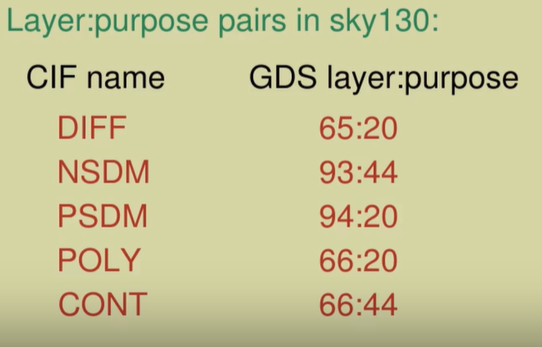

<h2>GDS2 format</h2>
    It uses stream to store layout details. It just contains the shapes but no electrical connectivity information.

<br/>
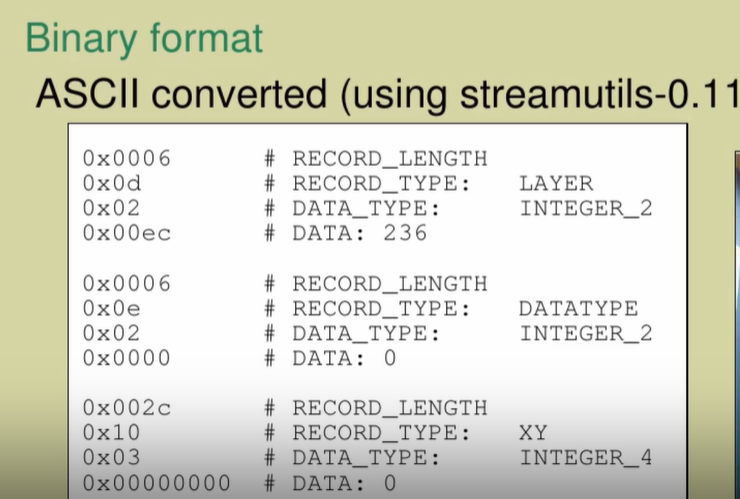

<h2> Extraction </h2>

From the layout generated, magic extract netlist to perform LVS checks.

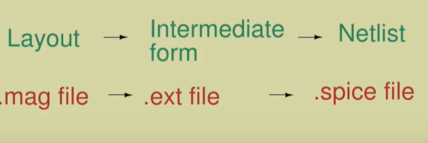

<h3> Extraction commands in Magic </h3>

<br/>

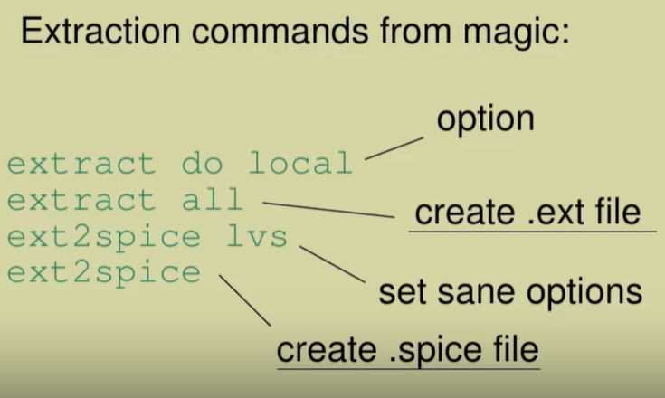

<br/>

<h3> Extraction styles </h3>

<br/>

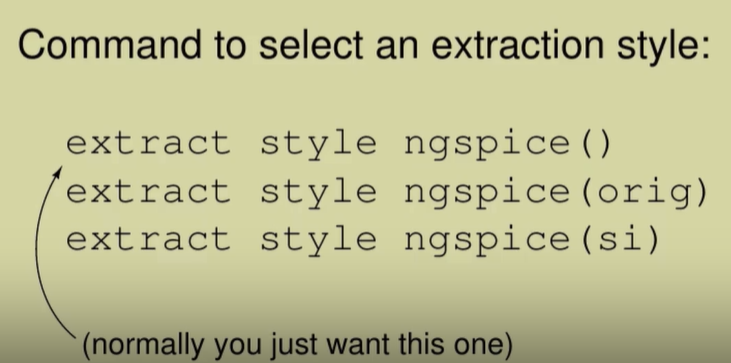

<br/>

<h3> Advanced Extraction commands </h3>

<br/>

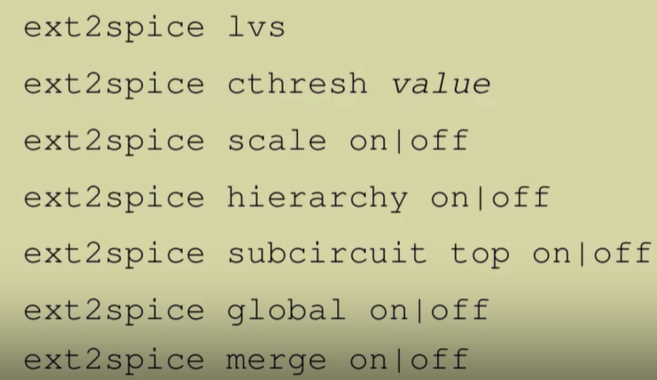

<br/>

<h3> Full RC Extraction commands </h3>

<br/>

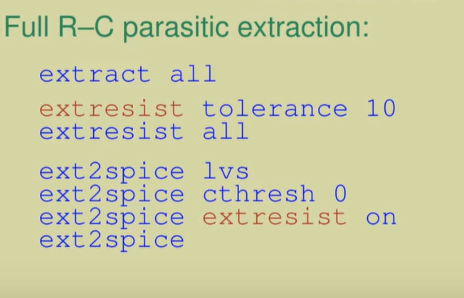

<br/>

<h2> GDS Reading and Writing in Magic </h2>

```
gds read file
gds readonly true|false
```
The readonly options does not alter the cell and even if its altered during layout creation the final GDS will contain the original layout of the cell.

The maglef cell describe the abstract view of cells.

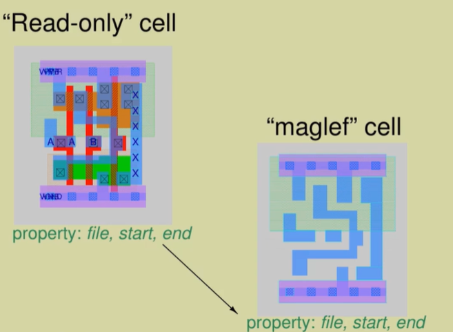

The abstract are provided by vendor as a black box for IP only revealing the metal connection pads. We can use these abstract cells, connect it and the final layout will work perfectly.

<h3> GDS Write </h3>

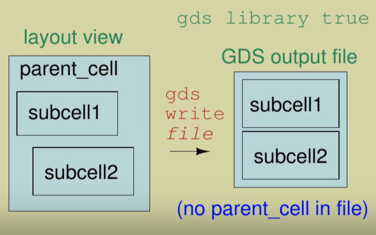

<br/>

The addendum prevents writing the vendor file being written, So we need to read the vendor files along with our GDS design.

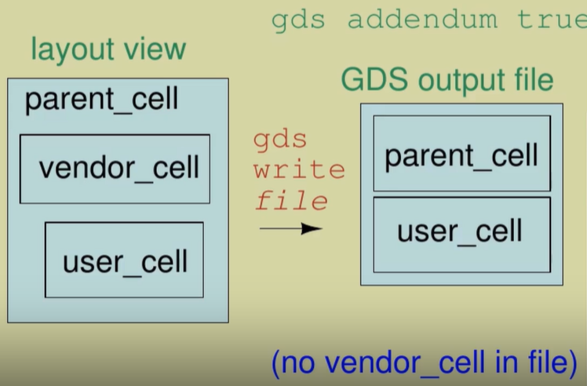

<br/>

<h2> DRC </h2>

```
drc(full) -> complete checks (slow)
drc(fast) -> typical checks  (fast)
drc(routing) -> metal checks (fastest)
```

<br/>

<h2> LVS - Layour Vs Schematic </h2>

The tech files provides the information whether the subcircuit is permutable(the pins of resistor can be in any order and it will work fine) or not.

It also provides information whether the devices can be combined. Resistors can be combined when in series or in parallel and based on that the length is adjusted.

Sometimes due to hierarchy LVS violations can occur. In the below case it occured due to flattened version of the same circuit in schematic. So flattening the hierarchy helps in this case.

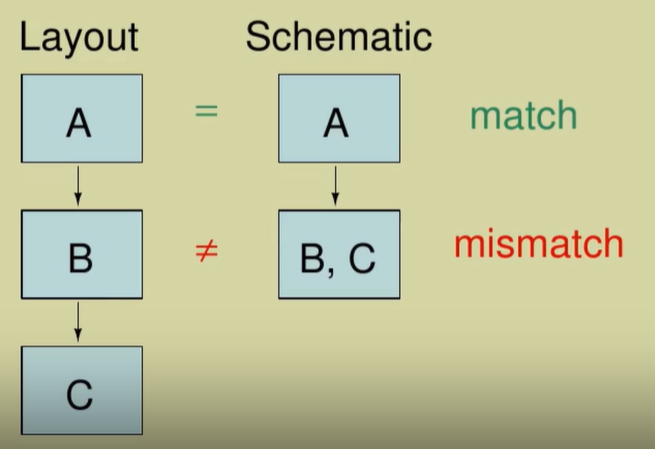

Sometimes flattening causes a cascading mismatch problem. The mismatch in the top layer will go into all the below layers causing the overall LVS to fail.

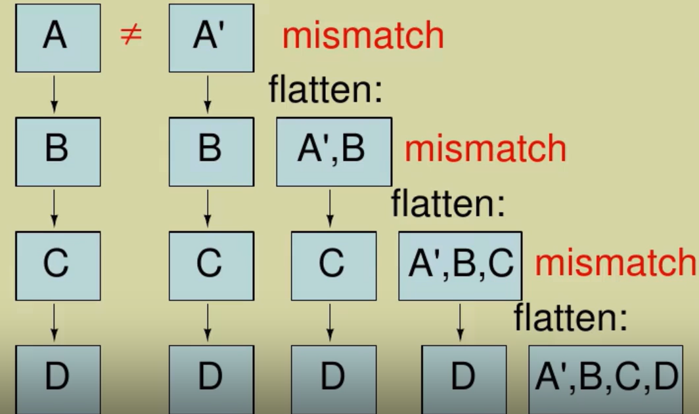

<h3> LVV - Layout Vs Verilog </h3>

It uses gate level verification and can work in hierarchy as well. But this prevents transistor level checking.

<h3>Verification using XOR</h3>

Applying XOR between two layout can only highlight the areas where there are changes. This can be done using magic, but for mask level XOR we need to use KLayout.

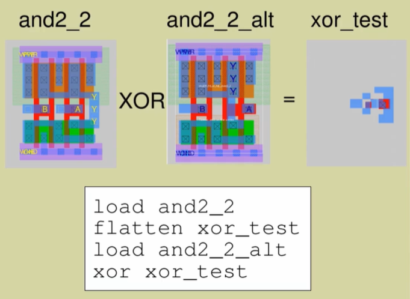

<h1> Lab Exercises </h1>

```
mkdir mag
cd mag
cp /usr/share/pdk/sky130A/libs.tech/magic/sky130A.magicrc ./.magicrc
magic -d XR
```

<h2> Styles </h2>

```
cif listall istyle
cif list istyle() -> list only current style.
To read GDS
% gds read /usr/share/pdk/sky130A/libs.ref/sky130_fd_sc_hd/gds/sky130_fc_sc_hd.gds
```

Now options -> cell_manager -> Choose and2_1 cell

```
cif istyle_sky130(vendor)
gds read /usr/share/pdk/sky130A/libs.ref/sky130_fd_sc_hd/gds/sky130_fc_sc_hd.gds

```
This replaces inplace. This could be used for reading vendor files.

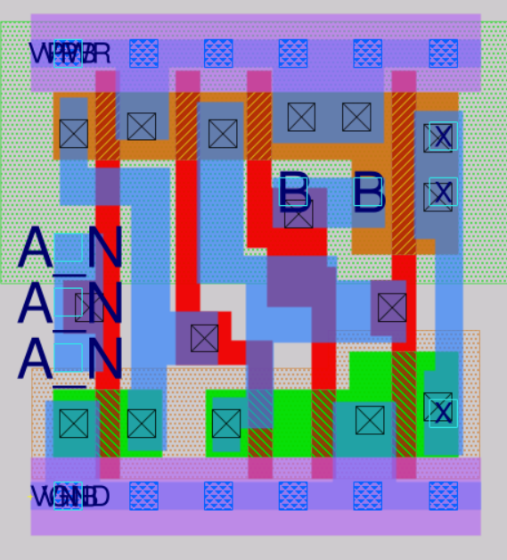


To solve override

```
gds noduplicates true
Now if we read as vendor styles, it won't replace the already read cells inplace.

```

<h2> Ports </h2>

Select a label and type **port index** to get the index of the port.

Magic preseves port order when writing layout. It annotates the data using lef files.

```
lef read /usr/share/pdk/sky130A/libs.ref/sky130_fd_sc_hd/lef/sky130_fd_sc_hd.lef
port 1 name -> to get name
port 1 use -> to get use
port 1 class -> bidirectional/directional

```

```
% readspice /usr/share/pdk/sky130A/libs.ref/sky130_fd_sc_hd/spice/sky130_fd_sc_hd.spice
% port first
1
% port 1 name
A
```

In Abstract views
    We need to read the entire lef file.
```
Open new Magic session.
lef read /usr/share/pdk/sky130A/libs.ref/sky130_fd_sc_hd/lef/sky130_fd_sc_hd.lef

Now Read the same and2_1 cell from cell manager.
Select the port and do as below

```

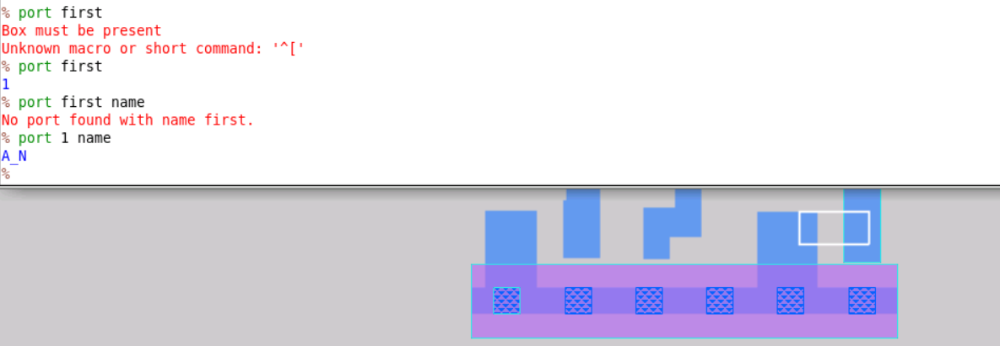

If we write an abstract cell as GDS in magic, it won't read the output GDS properly.

```
getcell <cell name>
gds write test
Close and open magic
gds read test -> Won't read properly.

```

<h3> Setting up for DRC </h3>

```
load sky130_fd_sc_hd__and2_1
% extract all 
ext2spice lvs
ext2spice
```
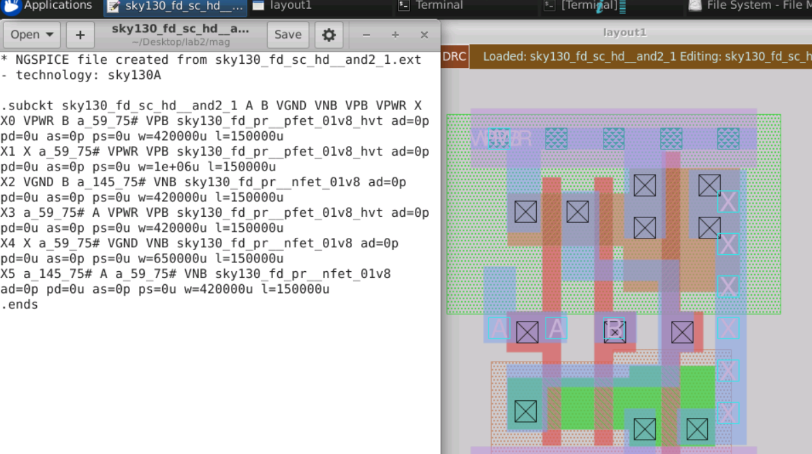

This gets the capactiance extraction
```
ext2spice cthresh 0
ext2spice
```
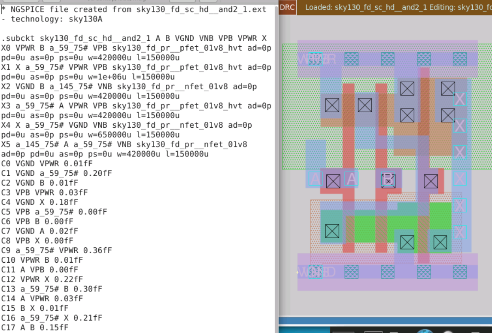

```
% ext2sim labels on 
% ext2sim -> Generates SIm file
extresist tolerance 10 -> TO get resistance
extresist
```

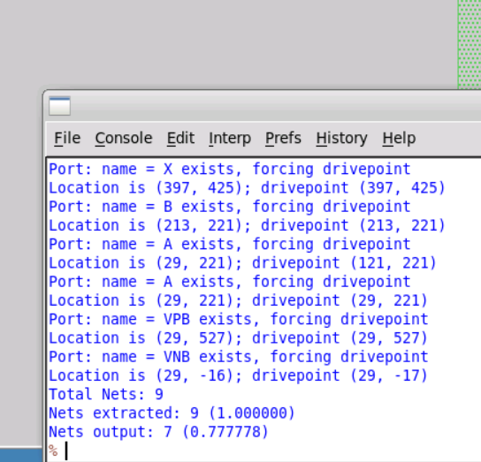

Getting RC parameters as final output.

```
ext2spice lvs
ext2spice cthresh 0.01
ext2spice extresist on
ext2spice
```

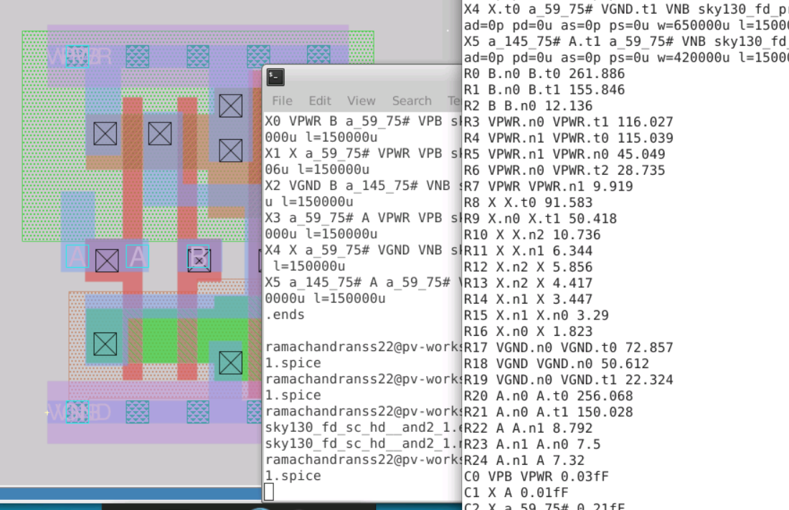

We can do full simulation and capture better results.

<h2> Setup for DRC </h2>

Running batch DRC. Use the python script from magic

```
ramachandranss22@pv-workshop-07:~/Desktop/lab2/mag$ /usr/share/pdk/sky130A/libs.tech/magic/run_standard_drc.py /usr/share/pdk/sky130A/libs.ref/sky130_fd_sc_hd/mag/sky130_fd_sc_hd__and2_1.mag
Evaluating full DRC results for layout sky130_fd_sc_hd__and2_1
Running: magic -dnull -noconsole -rcfile /usr/share/pdk/sky130A/libs.ref/sky130_fd_sc_hd/mag/.magicrc /home/ramachandranss22/Desktop/lab2/mag/run_magic_drc_sky130_fd_sc_hd__and2_1.tcl
Running in directory: /usr/share/pdk/sky130A/libs.ref/sky130_fd_sc_hd/mag

Magic 8.3 revision 195 - Compiled on Thu Aug  5 04:06:36 UTC 2021.
Starting magic under Tcl interpreter
Using the terminal as the console.
Using NULL graphics device.
Processing system .magicrc file
Sourcing design .magicrc for technology sky130A ...
2 Magic internal units = 1 Lambda
Input style sky130(vendor): scaleFactor=2, multiplier=2
Scaled tech values by 2 / 1 to match internal grid scaling
Loading sky130A Device Generator Menu ...
Loading "/home/ramachandranss22/Desktop/lab2/mag/run_magic_drc_sky130_fd_sc_hd__and2_1.tcl" from command line.
DRC style is now "drc(full)"
Loading DRC CIF style.
Using technology "sky130A", version 1.0.205-0-g6de165c
Done!

```
This saves the result in text file. The drc stle will be fast by default in Magic console. The full style is being run by the batch python script.


```
To do this in magic
%load sky130_fd_sc_hd__and2_1
% drc style
% drc listall style ->drc(fast) drc(full) drc(routing)
% drc style drc(full)

Select the whole design
drc check

To get individual errors.
See below
x -> Expand the layout (shows the metal colors)
> -> Go into the hierarchy
< -> Come out of hierarchy
```

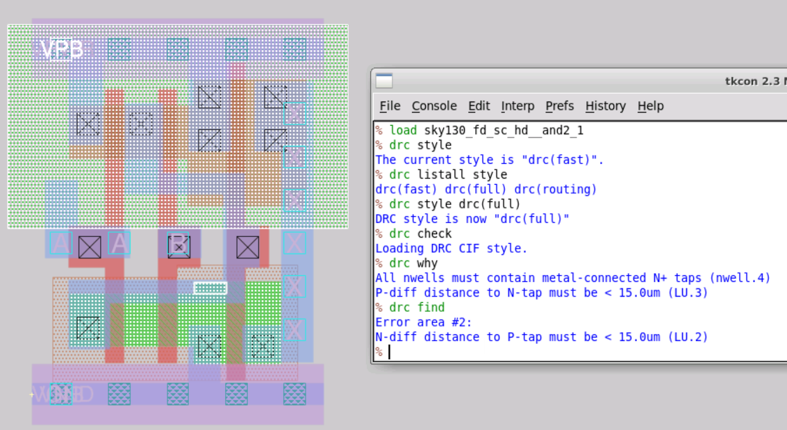

<h3> LVS </h3>

```
netgen -batch lvs "<spice file> <name of cell>" "<spice file> <name of cell>

first one from magic and second one from original spice file.
```

<h3> XOR </h3>

Magic can be used to do this.  To save and load 
save <name>  <br/>
load <name>  <br/>
erase li -> removes the selected item.

For comparing
```
flatten -nolabels xor_test -> Flatten and save our cell.
Load the standard cell and do Xor test
xor -nolabels xor_test
load xor_test -> See the result.
```