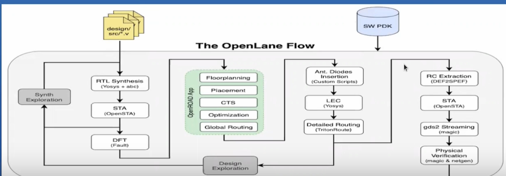

<h1> Day 4 -> PNR flow </h1>

OpenLANE flow is being described in detailed here using the open source tools.

<h2> Tools </h2>

<OL>
<LI>Synthesis - Yosys (performing RTL synthesis), ABC (performing Technology mapping)</LI>
<LI>STA - OpenSTA (done using ideal clocks)</LI>
<LI>Floorplanning - IO pins, core area , inserttion of welltap and decap, PDN</LI>
<LI>Placement - Global and detailed placement </LI>
<LI>CTS - TritonCTS (STA done using real clocks).</LI>
<LI>Global Routing - FastRoute(routing) ,Fill Insertion</LI>
<LI>Antenna Diode Insertion - DIODE_INSERTION_STRATEGY parameter is being used</LI>
<LI>Detailed routing - TritonRoute</LI>
<LI>RC Extraction - Magic</LI>
<LI>STA - Final STA</LI>
<LI>Physical verification - Magic (DRC and Antenna checks), KLayout (DRC), Netgen (LVS), CVC (Performs circuit validity checks).</LI>
<LI>GDS2 _ Magic and KLayout.</LI>
</OL>
