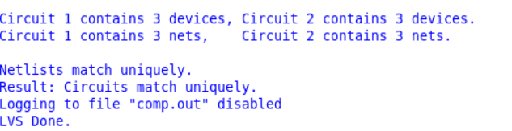
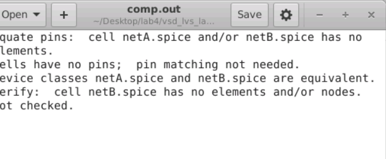
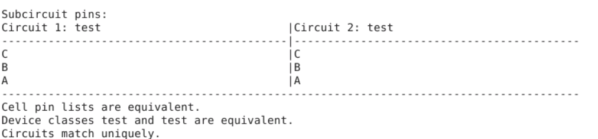

<h1> Running LVS </h1>

<h2> Labs </h2>

```
git clone https://github.com/RTimothyEdwards/vsd_lvs_lab.git

Exercise 1
netgen
In console
lvs netA.spice netB.spice
```



```
Exercise 2
reinitialize -> to clear memory if we don't close and open.
```



```
reinitialize
lvs "netA.spice test" "netB.spice test"

to test in subcircuit level.
```

